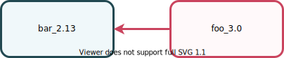
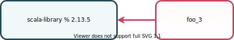
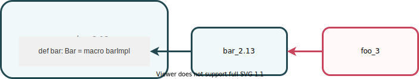
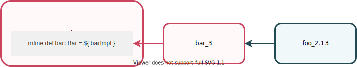
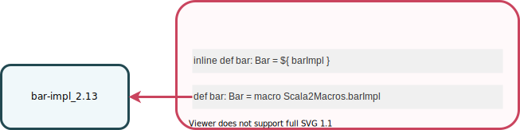

Scala 3 is a game changer in terms of compatibility in the Scala ecosystem that will greatly improve the day-to-day experience of the Scala programmers, starting from the migration.

In this page you will learn about the compatibility between Scala 2.13 and Scala 3.0 at different levels of the program lifetime.
You will then find how to benefit from these levels of compatibility in concrete examples of dependencies between Scala 2.13 and Scala 3.0.

## Source Level

A large subset of the Scala 2.13 language is still compatible in Scala 3.0.
Not all of it though, some constructs have been simplified, restricted or dropped altogether.
However those decisions were made for good reasons and by taking care that a good workaround is possible.

In general there is a straightforward cross-compiling solution for every incompatibility, so that the migration from Scala 2 to Scala 3 is easy and smooth.
You can find a corpus of incompatibilities associated with their solutions in the [Incompatibility Table](incompatibilities/table.md).

There is an exception though, which is the new metaprogramming framework that replaces the Scala 2 experimental macros.
Further explanations are given down below.

Setting metaprogramming aside, a Scala 2.13 source code can rather easily be translated into a Scala 3 source code.
Once you have it, you will be able to use the new powerful features of Scala 3, which have no equivalent in Scala 2.
Obviously you will lose the source code forward compatibility by doing so.
But amazingly, you can still have compatibility at compile time thanks to the TASTy reader.
As we will see in more details, it permits forward compatibility on many new features, except the most exotic ones.
This is a breakthrough in the Scala programming history.

## Compile Time

In your code you can use public types and terms, and call public methods that are defined in a different module or library.
It works well as long as the type checker, which is the compiler phase that validates the semantic consistency of the code, is able to read the signatures of those types, terms and methods, from the class files containing them.

In Scala 2 the signatures are stored in a dedicated format called the Pickle format.
In Scala 3 the story is a bit different because it relies on the TASTy format which is a lot more than a signature layout.
But, for the purpose of migrating from Scala 2 to Scala 3, only the signatures are useful.

### The Scala 3.0 Unpicklers

The first piece of good news is that the Scala 3.0 compiler is already able to read both formats, the Scala 2.13 Pickle format and the TASTy format, and thus it can type check code that depends on modules or libraries compiled by Scala 2.13 or Scala 3.0.

### The Scala 2.13 TASTy Reader

The second piece of good news is that the Scala 2.13 TASTy reader, which enables consuming Scala 3.0 libraries in Scala 2.13 has been shipped into `2.13.4`.
It supports all the traditional features as well as the following new features:
- Enums
- Intersection types
- Higher-kinded type lambdas
- Scala 3 extension methods
- New syntax for context abstraction
- Inheritance of `open` classes and `super` traits
- Exported definitions

You can have a Scala `@scala213@` module that depends on a Scala `@scala30@` module, and the latter can even depend on another Scala `@scala213@` module.
Cross-compatibility will not restrain you from using the exciting new features of Scala 3.0.

In short, we have backward and forward compatibility and so **migration can happen gradually and in any order**.

## Runtime

ABI, which stands for Application Binary Interface, is the representation of Scala code in bytecode or Scala.js IR.
It largely determines the runtime behavior of a piece of code.
Scala 2.13 and Scala 3.0 share the same ABI.
A piece of code, provided that the inferred types and implicit resolutions are the same, will produce the same bytecode and eventually have the same behavior at runtime.

Sharing the ABI ensures that Scala 2.13 and Scala 3.0 class files can be loaded by the same JVM class loader, and that Scala 2.13 and Scala 3.0 `sjsir` files can be linked together by the Scala.js linker.
Furthermore it relieves us from a lot of surprising behaviors at runtime.

## Metaprogramming

A macro definition produces bytecode that will be executed at compile time.
When you depend on a macro definition, the compiler loads the class file that contains it and then calls your macro method to produce the bytecode of your program, that will be executed at runtime.

The Scala 2.13 macro mechanisms, which were so far available under the `-experimental` flag, are closely tied to the Scala 2.13 compiler internals.
Therefore it is not possible for the Scala 3.0 compiler to execute them.

In contrast, the Scala 3.0 macros are based on the TASTy format which is designed for stability and compiler independence.
They will stay compatible with the future versions of the Scala 3 compiler.
But they are not compatible with the Scala 2.13 compiler, which it does no fully support TASTy.

In order to publish a common macro API for both languages you must provide both implementations.
A technique for declaring a Scala 2.13 macro in a Scala 3.0 artifact is exemplified down below and it is further detailed in the [Macro Migration Tutorial](macros/migration-tutorial.md#mixing-macro-definitions) section.

## Examples

### A Scala 3.0 module depending on a Scala 2.13 artifact

A Scala 3.0 module can depend on a Scala 2.13 artifact.



This diagram can be translated into sbt:

> sbt `1.4.+` is required

```scala
lazy val foo = project.in.file("foo")
  .settings(scalaVersion := "@scala30@")
  .dependsOn(bar)

lazy val bar = project.in(file("bar"))
  .settings(scalaVersion := "@scala213@)
```

Or, in case `bar` is a published Scala 2.13 library, we can have:

```scala
lazy val foo = project.in.file("foo")
  .settings(
    scalaVersion := "@scala30@",
    libraryDependencies += "org.bar" % "bar_2.13" % "1.0.0"
  )
```

#### The Scala Standard Library

The official standard library for Scala 3.0 is the Scala 2.13 library.
Not only the source code is unchanged but it is even not compiled and published under 3.0.
It could be, but it would be useless because, as we have seen, a Scala 3.0 module can depend on a Scala 2.13 artifact.

Therefore the Scala 3.0 dependency on the standard library follows this exact same pattern.



### A Scala 2.13 module depending on a Scala 3.0 artifact

As of `2.13.4` a Scala 2 module can depend on a Scala 3.0 library by enabling the Tasty reader with `-Ytasty-reader`.


This diagram can be translated into sbt:

```scala
lazy val foo = project.in.file("foo")
  .settings(
    scalaVersion := "@scala213@",
    scalacOptions += "-Ytasty-reader"
  )
  .dependsOn(bar)

lazy val bar = project.in(file("bar"))
  .settings(scalaVersion := "@scala30@")
```

Or, in case `bar` is a published Scala 3.0 library:

```scala
lazy val foo = project.in.file("foo")
  .settings(
    scalaVersion := "@scala30@",
    scalacOptions += "-Ytasty-reader",
    libraryDependencies += "org.bar" % "bar_3.0" % "1.0.0"
  )
```

### Macro dependencies

#### A Scala 3.0 module cannot depend on a Scala 2.13 macro

The Scala 3.0 compiler cannot execute a macro implemented in a Scala 2.13 artifact.


But a Scala 3.0 module can depend on a Scala 2.13 artifact whose compilation has involved a Scala 2.13 macro execution.



#### A Scala 2.13 module cannot depend on a Scala 3.0 macro

The Scala 2.13 compiler cannot execute a macro implemented in a Scala 3.0 artifact.


But a Scala 2.13 module can depend on Scala 3.0 artifact whose compilation has involved a Scala 3.0 macro execution.



> The macro could have been defined inside the Scala 3.0 module that consumes it.

#### A shared macro API in a Scala 3 artifact

A Scala 3.0 artifact can bear the declaration of the Scala 2.13 and Scala 3.0 macros next to one another.
The Scala 3.0 implementation can be provided in the same module.
The Scala 2.13 implementation must be compiled by the Scala 2.13 compiler, and so it must be provided by an other module.



This technique makes possible for the Scala 2.13 and Scala 3.0 compilers to execute a macro defined in the same Scala 3.0 artifact.
Yet, each will have its own execution path through the produced bytecode.

You can learn this technique in the [Macro Migration Tutorial](macros/migration-tutorial.md#mixing-macro-definitions).
Another working example can be found in [this repository](https://github.com/scalacenter/mix-macros-scala-2-and-3).
